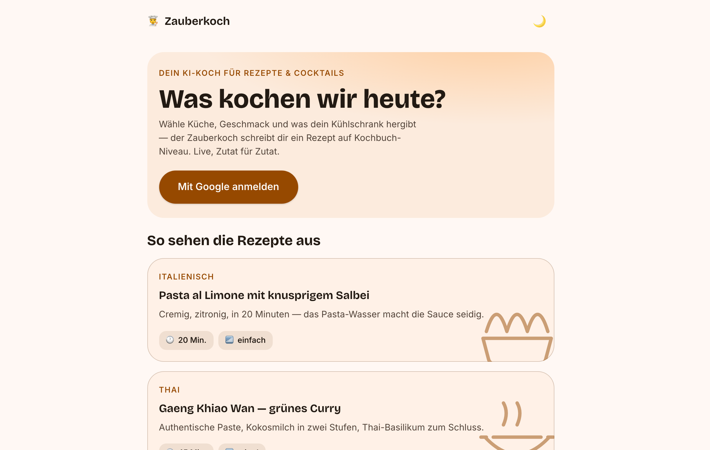
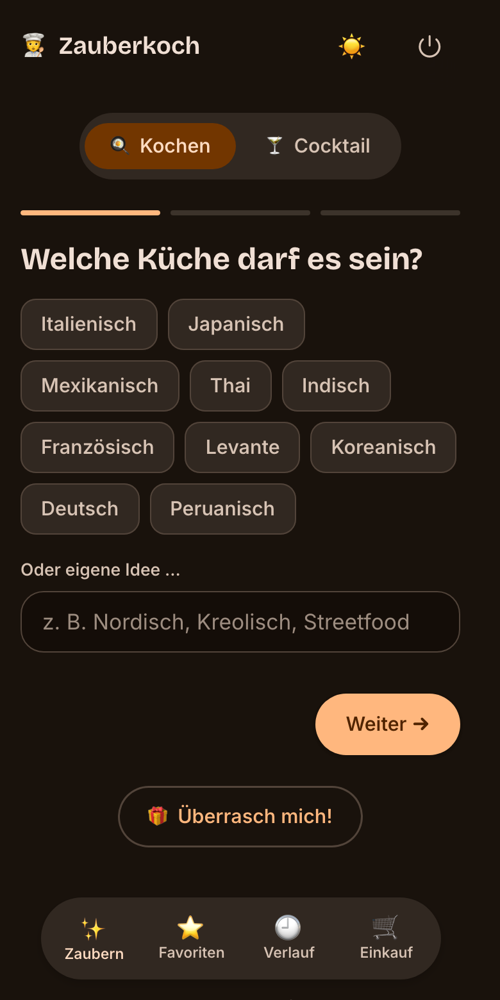
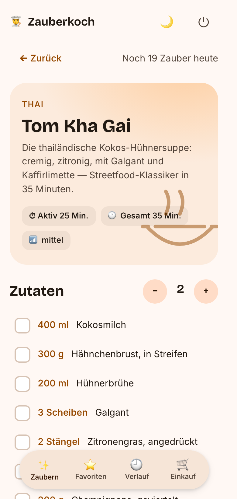
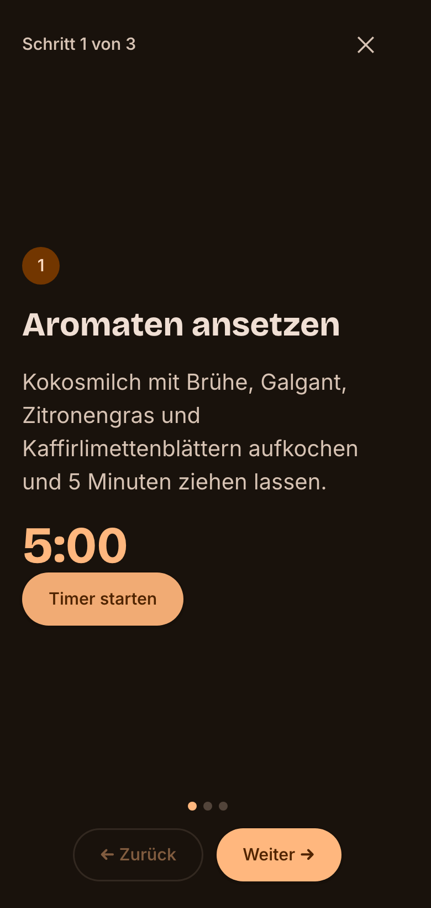

# Zauberkoch 🧑‍🍳🍸

[](https://github.com/pepperonas/zauberkoch-pwa/actions/workflows/ci.yml)
[](LICENSE)
[](backend/)
[](frontend/)
[](https://www.anthropic.com)
[](https://www.paypal.com/donate/?business=martin.pfeffer%40celox.io&currency_code=EUR)

**KI-Rezept- & Cocktail-Generator** — live unter **[zauberkoch.de](https://zauberkoch.de)**

Küche wählen, Geschmack wählen, Rahmenbedingungen setzen — der Zauberkoch schreibt ein Rezept auf Kochbuch-Niveau mit exakten Mengen. Das Rezept **baut sich live vor deinen Augen auf** (SSE-Streaming, kein Spinner-Gefängnis): erst Titel und Teaser, dann Zutat für Zutat, dann die Schritte.

## Screenshots

<p align="center">
  
</p>
<p align="center">
  
  
  
</p>

## Features

- 🪄 **Live-Streaming-Generierung** — semantische SSE-Events (Titel → Zutaten → Schritte → Tipps) aus einem inkrementellen JSON-Parser über der Claude-API (Structured Outputs, Prompt-Caching)
- 🍳/🍸 **Zwei Modi** — Kochen & Cocktails (inkl. Mocktails, cl-Angaben, shaken/stirred/built), mit animiertem Farbschema-Morph (Safran ↔ Violett)
- 🧙 **3-Schritt-Wizard**, komplett überspringbar: Länderküche, Geschmacks-Chips, Constraints (Diät, Zeit, Schwierigkeit, „Was hab ich im Kühlschrank"), „Überrasch mich"
- 📱 **Koch-Modus** — Vollbild, ein Schritt pro Screen, Swipe-Navigation, integrierte Timer, Wake Lock
- 🔢 **Portionen-Stepper** mit live skalierenden Mengen und rollenden Ziffern
- 🛒 **Einkaufsliste** — Zutaten mehrerer Rezepte werden aggregiert (Einheiten normalisiert: kg→g, cl→ml), Drag-Reorder, Teilen, überall Undo
- ⭐ **Favoriten & Verlauf** mit Suche und Filtern
- 🔗 **Teilen** — unlisted Links mit server-seitig generierten OG-Thumbnails (Pillow, 1200×630); geteilte Rezepte können in die eigene Sammlung übernommen werden
- 🎨 **Material 3 Expressive, handgebaut** — Design-Tokens als CSS Custom Properties, echte Spring-Physik (Motion), `prefers-reduced-motion` überall
- 📲 **PWA** — installierbar, Favoriten offline lesbar
- 🔐 Google OAuth (PKCE, server-seitig), httpOnly-Sessions, CSRF-Schutz, Tageslimits pro User + global

## Stack

| Layer | Technologie |
|---|---|
| Backend | Python 3.12 · FastAPI · SQLite (WAL) · SQLAlchemy 2 · Alembic |
| KI | Anthropic API (`claude-sonnet-5`, per env tauschbar) · Streaming · Structured Outputs · Prompt-Caching |
| Frontend | React 19 · Vite · TypeScript strict · TanStack Query · Motion |
| Auth | Google OAuth 2.0 (Authorization Code + PKCE) · httpOnly-Cookies |
| Deploy | systemd + nginx (SSE-tauglich) · Let's Encrypt |

## Lokales Setup

```bash
# Backend
cd backend
python3.12 -m venv .venv && source .venv/bin/activate
pip install -r requirements-dev.txt
cp ../.env.example .env        # ANTHROPIC_API_KEY, Google-Creds, SESSION_SECRET eintragen
alembic upgrade head
python -m scripts.allowlist add du@example.com
uvicorn app.main:app --reload --port 8742

# Frontend (zweites Terminal)
cd frontend
npm install
npm run dev                    # http://localhost:5173, /api → Proxy auf :8742
```

Google-OAuth-Einrichtung: [`docs/GOOGLE-OAUTH.md`](docs/GOOGLE-OAUTH.md) · Deployment: [`docs/DEPLOY.md`](docs/DEPLOY.md)

## Tests

```bash
cd backend && pytest             # Auth, Rate-Limits, Cache, SSE-Parser, Prompts, Share/OG …
cd frontend && npm test          # Mengen-Skalierung, Einheiten, i18n, Share-Text
cd frontend && npx playwright test   # E2E-Smoke (lokal)
```

Alle Suiten laufen bei jedem Push als [GitHub Action](.github/workflows/ci.yml).

## Unterstützen

Zauberkoch ist ein Hobby-Projekt. Wenn es dir gefällt:

[](https://www.paypal.com/donate/?business=martin.pfeffer%40celox.io&currency_code=EUR)

## Lizenz & Credits

[MIT](LICENSE) © 2026 Martin Pfeffer | [celox.io](https://celox.io)

Fonts: [Inter](https://rsms.me/inter/) und [Bricolage Grotesque](https://github.com/ateliertriay/bricolage) (SIL Open Font License). Gebaut mit [Claude Code](https://claude.com/claude-code).
